# 📊 Student Performance Analysis

A Python data analysis project that explores the factors influencing student academic performance using **Pandas, NumPy, and Matplotlib**.

The project analyzes a dataset of **200 students** and investigates relationships between study habits, attendance, previous academic performance, assignments, CGPA, and final scores.

---

## 🎯 Project Objective

The main objective of this project is to:

- Analyze student academic performance using Python.
- Identify factors that may influence final student scores.
- Explore relationships between study hours, attendance, CGPA, and academic scores.
- Perform data cleaning and statistical analysis.
- Create meaningful data visualizations.
- Generate insights from the analyzed dataset.

---

## 📁 Dataset

The dataset contains information about **200 students**.

| Column | Description |
|---|---|
| Student_name | Name of the student |
| Student_ID | Unique student identification number |
| Age | Age of the student |
| Branch | Engineering branch |
| Study_Hours | Average daily study hours |
| Attendance | Attendance percentage |
| Previous_Score | Previous academic score |
| Assignments_Score | Assignment score |
| CGPA | Current CGPA |
| Final_Score | Final examination score |

### Dataset Statistics

- **Total Students:** 200
- **Total Features:** 10
- **Missing Values:** 0
- **Duplicate Rows:** 0
- **Engineering Branches:** 6

---

## 🛠️ Technologies Used

- **Python**
- **Pandas** – Data loading, cleaning, and analysis
- **NumPy** – Numerical operations
- **Matplotlib** – Data visualization
- **VS Code** – Development environment
- **Git & GitHub** – Version control and project hosting
---## 🔍 Project Workflow

```text
Dataset
   ↓
Data Loading
   ↓
Data Inspection
   ↓

   Data Cleaning
   ↓
Descriptive Statistics
   ↓Numerical Analysis
   ↓

Correlation Analysis
   ↓Data Visualization
   ↓
Insights and Conclusions
```

---

## 📊 Analysis Performed

The project performs the following analyses:

### 1. Dataset Inspection

- Checked dataset shape and dimensions.
- Examined column names and data types.
- Reviewed the first and last records.

### 2. Data Quality Analysis

- Checked for missing values.
- Checked for duplicate records.
- Verified numerical and categorical columns.

### 3. Descriptive Statistics

Calculated:

- Mean
- Median
- Minimum
- Maximum
- Standard deviation

for important numerical features.

### 4. Numerical Analysis

Analyzed relationships between:

- Study Hours and Attendance
- Study Hours and CGPA
- Attendance and Previous Score
- Previous Score and Assignment Score
- Assignment Score and CGPA
- CGPA and Final Score

### 5. Correlation Analysis

A correlation matrix was generated to understand the relationships between numerical variables.

---

## 📈 Visualizations

### Correlation Matrix

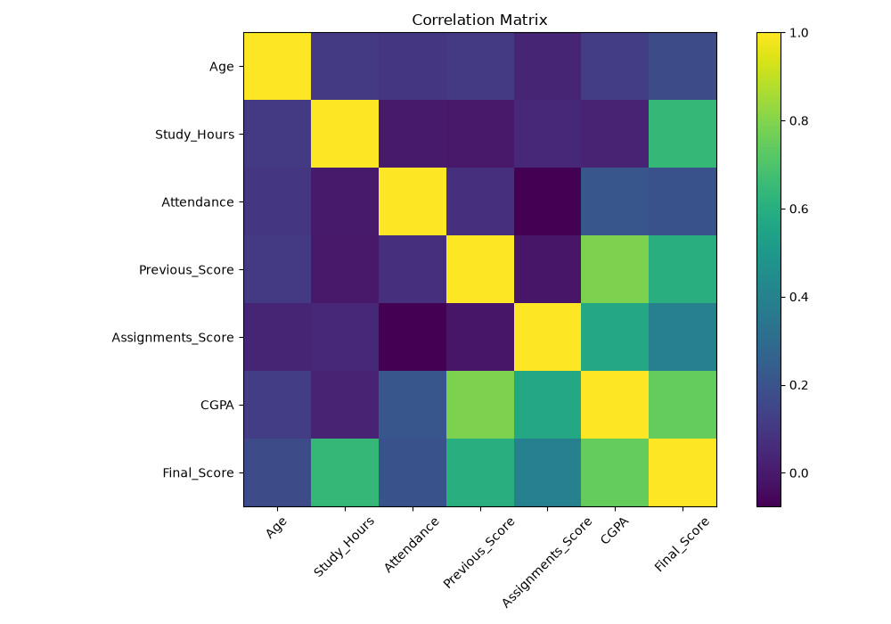

### Branch Distribution

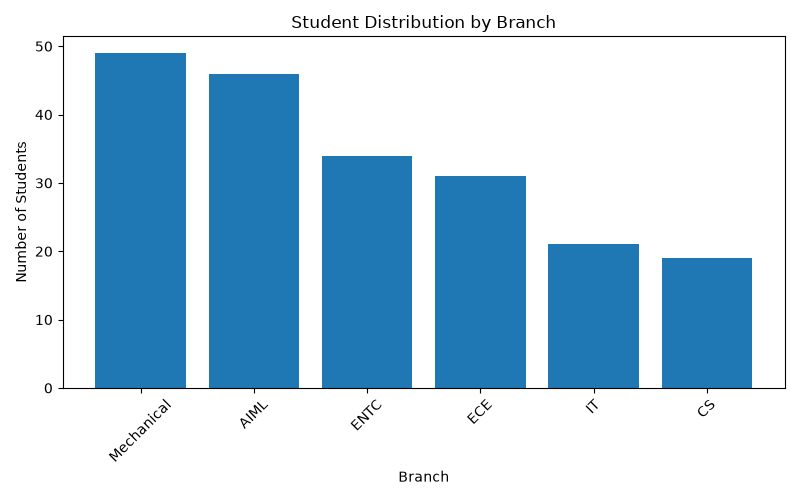

### Age Distribution

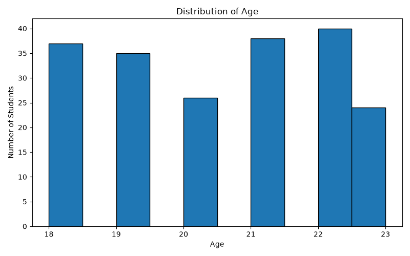

### Attendance Distribution

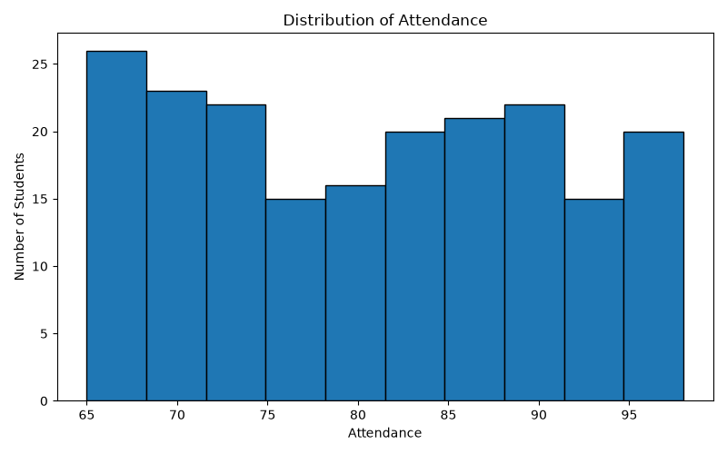

### CGPA Distribution

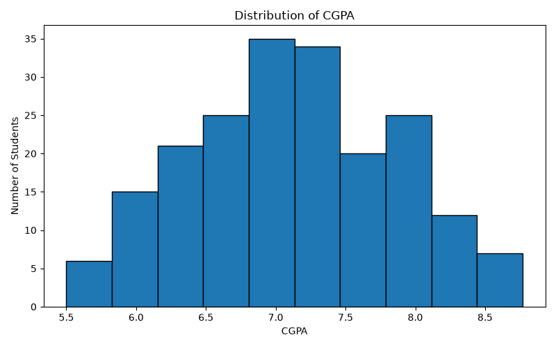

### Final Score Distribution

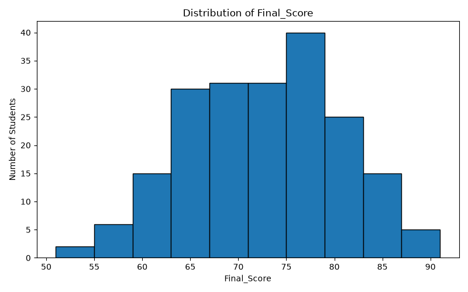

### Study Hours Distribution

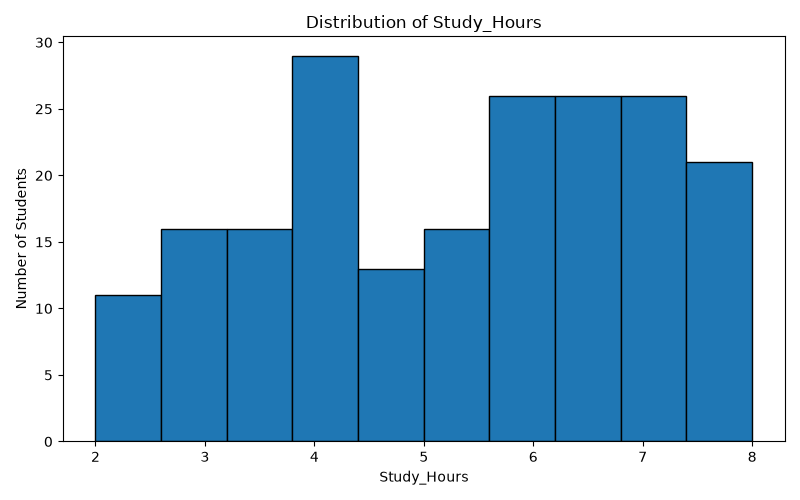

### Previous Score Distribution

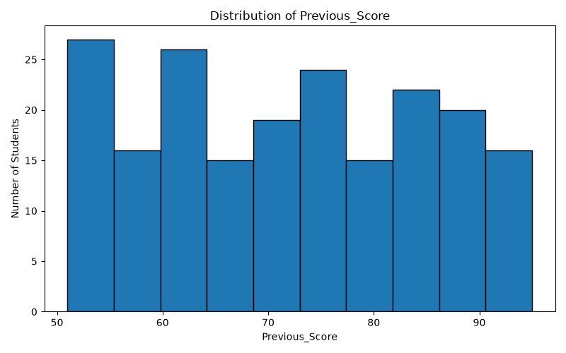

### Assignment Score Distribution

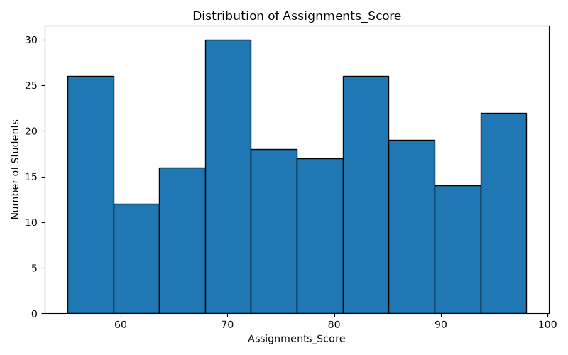

---

## 📉 Scatter Plot Analysis

### Age vs Study Hours

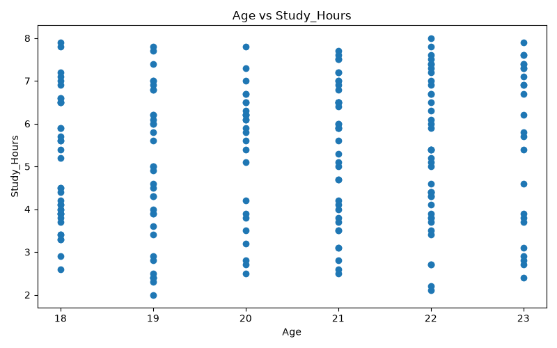

### Study Hours vs Attendance

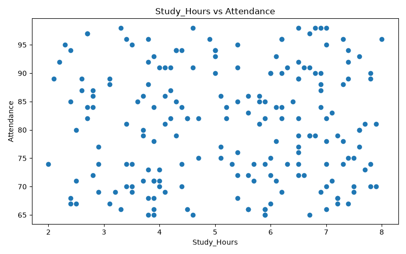

### Attendance vs Previous Score

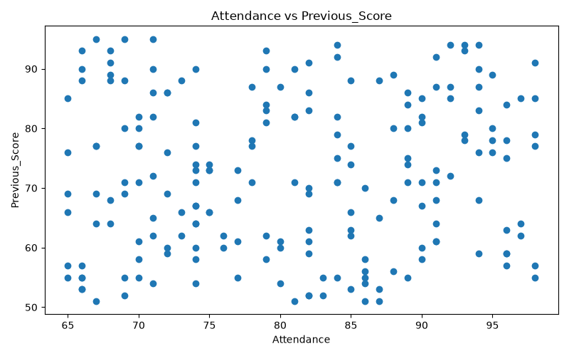

### Previous Score vs Assignment Score

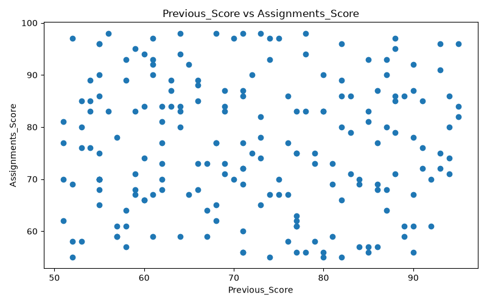

### Assignment Score vs CGPA

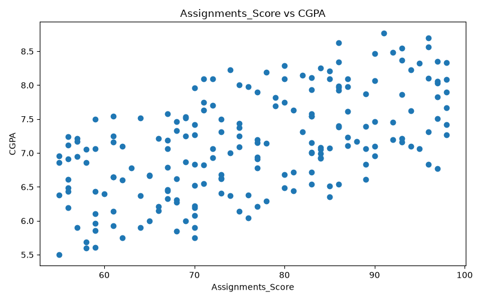

### CGPA vs Final Score

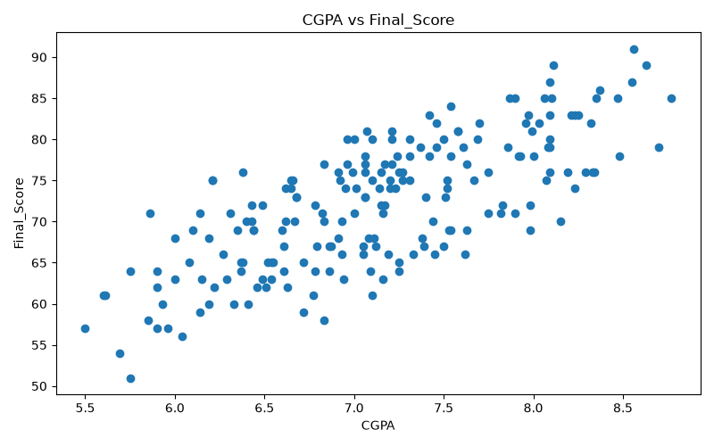

---

## 💡 Key Insights

The analysis helps identify patterns in student academic performance.

Some observations from the dataset include:

- Students have different levels of study hours and attendance.
- Academic performance varies across different engineering branches.
- Previous academic scores show a relationship with later performance.
- Assignment performance can provide useful information about overall academic performance.
- CGPA and final scores can be compared to understand academic consistency.
- Correlation analysis helps identify which numerical variables have stronger relationships.

> **Note:** The dataset is used for educational and analytical purposes and does not represent a real institutional student database.

---

## 📂 Project Structure

```text
student-performance-analysis/
│
├── outputs/
│   ├── analysis_summary.txt
│   ├── cleaned_students.csv
│   ├── correlation_matrix.png
│   ├── bar_chart_Branch.png
│   ├── histogram_Age.png
│   ├── histogram_Attendance.png
│   ├── histogram_CGPA.png
│   ├── histogram_Final_Score.png
│   ├── histogram_Study_Hours.png
│   ├── histogram_Previous_Score.png
│   ├── histogram_Assignments_Score.png
│   ├── scatter_Age_vs_Study_Hours.png
│   ├── scatter_Attendance_vs_Previous_Score.png
│   ├── scatter_CGPA_vs_Final_Score.png
│   ├── scatter_Previous_Score_vs_Assignments_Score.png
│   ├── scatter_Study_Hours_vs_Attendance.png
│   └── scatter_Assignments_Score_vs_CGPA.png
│
├── README.md
├── student_analysis.py
├── students.csv
└── .gitignore
```

---

## ▶️ How to Run the Project

### Step 1: Clone the Repository

```bash
git clone https://github.com/orophile08/student-performance-analysis.git
```

### Step 2: Open the Project

```bash
cd student-performance-analysis
```

### Step 3: Install Required Libraries

```bash
pip install pandas numpy matplotlib
```

### Step 4: Run the Analysis

```bash
python student_analysis.py
```

The analysis results and visualizations will be generated inside the `outputs` folder.

---

## 📋 Output Files

The project generates:

- Cleaned dataset
- Analysis summary
- Correlation matrix
- Bar charts
- Histograms
- Scatter plots

These outputs make it easier to understand the dataset and communicate the analysis results.

---

## 🚀 Future Improvements

Possible improvements for this project include:

- Add interactive dashboards using **Power BI** or **Tableau**.
- Build a student performance prediction model using **Machine Learning**.
- Perform feature importance analysis.
- Add more student-related features.
- Compare performance across different branches.
- Develop an interactive web application for the analysis.
- Add advanced statistical analysis.

---

## 🎓 Learning Outcomes

Through this project, I practiced:

- Python programming
- Data cleaning
- Data preprocessing
- Exploratory Data Analysis (EDA)
- Statistical analysis
- Correlation analysis
- Data visualization
- Pandas
- NumPy
- Matplotlib
- Git and GitHub
- Project documentation

---

## 👨‍💻 Author

**Rohit Patil**

Artificial Intelligence & Machine Learning Student

Zeal College of Engineering and Research, Pune

---

## ⭐ Project

If you find this project useful, feel free to ⭐ the repository.

**GitHub Repository:**  

https://github.com/orophile08/student-performance-analysis